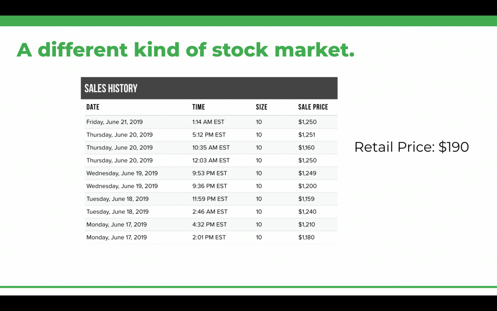

# How to make a good data science presentation

## Know your audience, don't assume they know as much about your problem as you do

Setting up the problem that you tackled is essential. 

## Use animations and color to guide the viewer

Your presentation should flow as you make each point, not feel like you're moving from static points. Embrace the use of animations! You want the viewer to be focused on you and the narrative you are telling. When you drop a screenful of text on people, their natural instinct is to try to scan through all of it at once, thus diverting their attention between you and the screen. Walking through your presentation deliberately with animations allows breathing room for your listener to see and digest the information you want to convey. 

Similarly, use opacity and color to emphasize the points you want to make. 

## Identify the challenges that are unique to problems in your domain.

As you demo your project, it is essential to understand and highlight the instances where your data did not conform to conventional norms. Companies are looking for data scientists that have an ability to grasp the nuances of data within their domain and apply that deep understanding to be creative in the ways that they model their data. Identifying why the problem you are tackling is more difficult than first meets the eye or bringing experience within a domain will demonstrate evidence of this ability.

## Talk about the tradeoffs

There are constant trade offs. When you choose to model a problem, why did you make a certain choice? Data science requires experimentation, so talk about the different hypotheses you made and thought would pan out. Be careful here though, the goal is not say "I tried out 6 different models and found the one with the highest F1 score." Rather, you want to talk about the **purposeful** choices that you made and the justification for each one. For example, maybe you initially tried a logistic regression model to classify your data, but after some testing and investigation, found that your data was actually non-linear, and that a kernel based support vector classifier was a more appropriate approach. 

## Connect your validation and error metrics back to your original problem

You run a model and it has a sweet 10 point root mean squared error (RMSE). Great, but what does that mean in context of your business or user? A good data science presentation connects results to a problem. For example, if you were trying to figure out how much to price wedding dresses on Ebay, a 10 point error on a $1,000 dollar wedding dress could potentially cost your user X dollars. 

## Talk about the highs and the lows

Companies want to know about the challenges you faced. They want to know why this was a challenge, and how you overcame it? You're telling a story. Imagine a story in which the hero conquers each challenge with ease. That's not very interesting right? What do you know about the hero now that you didn't know before? If you heard about how the hero had to push through multiple challenges and the skills that they used, isn't that much more entertaining for a listener and something that will stick in their mind?

Note, highlight challenges that showcase your creativity and thoughtfulness in approaching problems. Telling companies, "I had a hard time reading the data in pandas" is unlikely to win you any points..

## Target your About Me to your listener

Memory studies suggest that primacy and recency effects. That means how you set up your presentation and how you end it are the most important components of making a strong impression. Your "About Me" slide is your last chance to pitch yourself and how your experience is relevant to other roles. This is an area that many fellows struggle with. As academics, we are trained to downplay our accomplishments or normalize them. Interviewing for a job is not one of those times! Understand what makes you special and unique to others. Know what experiences you have that are relevant to what a company does and tailor your pitch about yourself that people have reasons to vouch for you.

 
<!--stackedit_data:
eyJoaXN0b3J5IjpbLTE1ODcyNjI2ODIsMjc2OTkxNjYwXX0=
-->