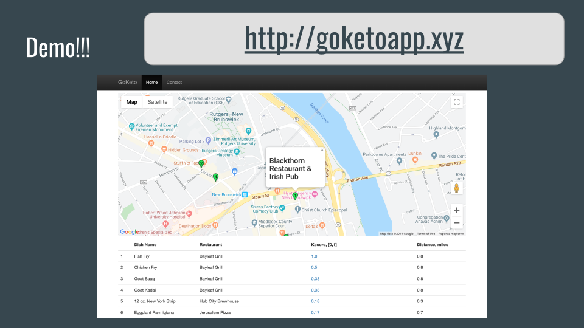

# How to think like a data scientist in industry

At Insight, we help high achieving scientists transition from academia to industry. In this short article, I will highlight how to think more like a data scientist in industry and how previous fellows at Insight have demonstrated this ability to get jobs at leading companies.

## Focus on product and the business impact

Pretend for a moment you are a data scientist at a company that is considering whether or not to add a feature to a product. To help make your decision, you might use the following questions to drive your analysis.

1) How are users currently interacting with that product? 
2) What does that product currently lack that causes a pain point for users?
3) What would a quick solution to these users problems look like?
4) What is the potential benefit for the company?

It's important to understand how your work helps move a product forward, or how it enables the business of a company to grow. Focusing on the real problems your users have anchors your project and helps motivate the subsequent choices you make.

- **Example**: "Finding art for your home can be a difficult and time consuming process. Purchasing art online is especially challenging because online retailers use keywords to describe visual imagery. Potential art enthusiasts are challenged with accurately describing art in search bars. The customer experience, and sales, for companies like Etsy or Artsy would be improved if users could provide an example of paintings that they liked and were shown other paintings that matched the visual subtleties of the examples provided.

Paint by Numbers by [Justin Morse](https://www.linkedin.com/in/jcmorse/)

- **Commentary**: In the e-commerce world, consumers are often paralyzed by an overabundance of choice. A simple search for art on Etsy can yield hundreds of thousands of results. This project helped simplify the purchasing process by allowing users to drop in or take a picture of their favorite pieces of art and by using computer vision to identify latent image features that matched art on the Etsy and Artsy marketplaces. Users were then provided recommendations of similar pieces of art at multiple price points, so that they could select the right piece for their budget.

## Know what the right data is to solve your problem

Once you have a problem defined, it's important to consider what data you need. These days, companies have almost *too much* data, forcing data scientists to consider which sources of data are most relevant for their problem. One way to do this is to continue to refer back to how your user, company, or community of users interact with the product or business. How is that data captured? How much of that data is available and what can you do with it?

Sometimes the data you need doesn't exist. In cases like this, you may have to get creative to find a solution. You might have to combine different datasets to serve as a proxy for what you want to measure.

- **Example**: "NYC Parks is tasked with managing over 600,000 street trees, but has the resources to inspect and maintain less than 50,000 trees per year. Currently, NYC relies on highly-biased citizen-submitted tree service requests to prioritize trees for maintenance, which results in over 10,000 tree branch falls per year and substantial cost to the City. Resources could be more efficiently allocated if there was a way to prioritize which trees were highest priority for maintenance."

[TreeFall NYC](https://platform.insightdata.com/projects/treefall-nyc) by [Brianne Hendrickson-Smith](https://www.linkedin.com/in/briannekhsmith/)

- **Commentary**: New York City often has to be reactive to customer complaints, deploying public services after an event has happened. This project was focused on helping the NYC Parks department be proactive about identifying which trees in New York City were most likely to have a tree branch fall. The final solution integrated public open data from 311 citizen requests, the New York street tree census, and land cover databases. These three sources helped provide additional signal to determine which trees in which areas should be given the highest priority for maintenance. 

## Give your users actionable insight

Data scientists derive value from the ability to take amorphous problems and turn them into actionable insight that "closes the loop". Whoever your stakeholder is, you want to be able to empower your user to do something with your results. This means understanding who the target of your modeling is focused on and making conscious choices along the way with that specific user in mind. Does the result of your work allow your user to be able to actively modify their behavior in response to what you show them?

**Example**: "Staying on a diet is tough and it's estimated that only 20% of dieters stay on a regime after one month. For people on the ketogenic diet, this problem is further exacerbated by a difficulty in finding suitable keto-friendly options when choosing to eat out. The combination of a stringent dieting regime and lack of readily available nutritional information on most restaurants can spell disaster for the aspiring dieter."

[GoKeto](https://platform.insightdata.com/projects/goketo) by [Daniel Beltran-Villegas](https://www.linkedin.com/in/daniel-beltran-villegas/)

**Commentary**: This project identified a group of users with limited choice and restricted behaviors. The final product utilized Grubhub menu information from local restaurants and nutritional information from major chain restaurants to locate meal options for ketogenic dieters based on their current location. The fellow was able to not only able to viable restaurants for dieters, but also which menu items were most keto-friendly. In doing so, this project provided dieters with a range of choices that suited their dietary lifestyles.

## Build something that works, then iterate

Data scientists in industry are often required to move quickly and meet deadlines. That means building a prototype and then iterating on it to provide improvements. One of the fastest ways to learn is through failure, and no idea is ever perfect from the start. Start with a simple solution, and then layer in the complexity.

## Avoid these common pitfalls

### Fixating on a technique or technology

When working with data, the tools and techniques you use should align with what best suits the problem. Have you ever heard someone say, "Here's some data. I don't care what you do, but can you make sure you use word2vec and Spark?" 

Yeah, I didn't think so either.

### Replicating something a company already does

Replicating an existing product or a need that is already being served does not help showcase an ability to identify new areas of exploration. Ask yourself, can you identify areas of need that are not already being covered? Users will only engage with your product if its better than what currently exists. Have a product vision  that will solve an unexplored problem.

### Starting with a data set

One of the first impulses for many people is to dig into a dataset to find something "interesting" or to a model with the highest accuracy possible. The problem here is that when you don't start with a top-down approach, you make choices that are not motivated by a problem or a user. It is then obvious to others that you have not started by thinking about the business or the issue.

<!--stackedit_data:
eyJoaXN0b3J5IjpbLTI4MjcxNzA2OSwyMTE1MjY0ODIsLTQ3Mz
kyNzI4NCwxNzQ0NTA2MjAwLC0zNTk1NjM2NzMsMTM1ODg1MTA2
NywyNjI3MTA1ODcsNjY2MjMzNzQyLC0xNjkyOTg0MDkwLDExNj
Q4MTc2NywtMTcwNDI0MTU3NV19
-->