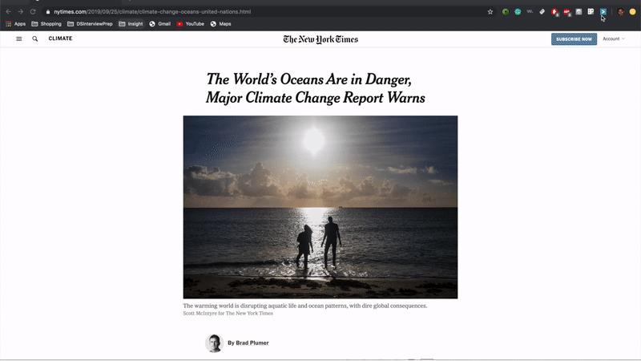

# How to think like a data scientist in industry

At Insight, we help high achieving scientists transition from academia to industry. In this short article, I will highlight how to think more like a data scientist in industry and how previous fellows at Insight have demonstrated this ability to get jobs at leading companies.

## Focus on product and the business impact

Data scientists derive value from the ability to take amorphous problems and turn them into actionable insight that "closes the loop". It's important to understand how your analysis helps move a product forward, or how your analysis circles back to the business of a company. Do you solve real problems your users are having and can you explain why? Starting with a problem and a user-base anchors your analyses and helps motivate the subsequent choices you make.

For example, if you were a data scientist at a company that was considering whether or not to add a feature to a product, you might use the following questions to drive your analysis.

1) How are people currently interacting with that product? 
2) What does that product currently lack that causes a pain point for users?
3) What would be the potential benefit for the company?

- **Example**: "Finding art for your home is a difficult and time consuming process. Searching for art online is especially difficult because online retailers use keywords to describe visual imagery. The customer experience would be improved if users could provide an example of paintings that they liked and were shown other paintings that matched the visual subtleties of the examples provided.

Paint by Numbers by [Justin Morse](https://www.linkedin.com/in/jcmorse/)

- **Commentary**: In the e-commerce world, consumers are often paralyzed by an overabundance of choice. A simple search for art on Etsy can yield hundreds of thousands of results. This project helped simplify the purchasing process by allowing users to drop in or take a picture of their favorite pieces of art and by using computer vision to identify latent image features that matched art on the Etsy and Artsy marketplaces. Users were then provided recommendations of similar pieces of art at multiple price points, so that they could select the right piece for their budget.

## Know what the right data is to solve your problem

Once you have a problem defined, it's important to consider what data you need. These days, companies have almost *too much* data, forcing data scientists to consider which sources of data are most relevant for their problem. One way to do this is to continue to refer back to how your user, company, or community of users interact with the product or business. How is that data captured? How much of that data is available and what can you do with it?

Sometimes the data you need doesn't exist. It might require using your creativity. Can you find a proxy for that data? Can you combine datasets to serve as a proxy for what you want to measure?

- **Example**: "NYC Parks is tasked with managing over 600,000 street trees, but has the resources to inspect and maintain less than 50,000 trees per year. Currently, NYC relies on highly-biased citizen-submitted tree service requests to prioritize trees for maintenance, which results in over 10,000 tree branch falls per year and substantial cost to the City. Resources could be more efficiently allocated if there was a way to prioritize which trees were highest priority for maintenance."

[TreeFall NYC](https://platform.insightdata.com/projects/treefall-nyc) by [Brianne Hendrickson-Smith](https://www.linkedin.com/in/briannekhsmith/)

- **Commentary**: This project involved combining multiple New York City open datasets that contained information on 311 requests, specialized tree information, and geographical data. One of the strengths of this project was that it required the combination of multiple datasets from data sources. The end product was a preventative tree maintenance tool for NYC Parks that prioritized trees based on predicted branch fall probability.

## Give your users actionable insight

Whether your work is focused on product users or stakeholders within your company, it is important to empower your user to do something with your results. This means understanding who the target of your modeling is focused on and making conscious choices along the way with that specific user in mind. Does the result of your work allow your user to be able to actively modify their behavior in response to what you show them?

**Example**: "Staying on a diet is tough and it's estimated that only 20% of dieters stay on a regime after one month. For people on the ketogenic diet, this problem is further exacerbated by a difficulty in finding suitable keto-friendly options when choosing to eat out. The combination of a stringent dieting regime and lack of readily available nutritional information on most restaurants can spell disaster for the aspiring dieter."

[GoKeto](https://platform.insightdata.com/projects/goketo) by [Daniel Beltran-Villegas](https://www.linkedin.com/in/daniel-beltran-villegas/)

**Commentary**: This project identified a group of users with limited choice and restricted behaviors. The fellow developed an app, using Grubhub menu information from local restaurants and nutritional information from major chain restaurants to locate meal options for ketogenic dieters based on their location. The fellow was able to not only able to viable restaurants for dieters, but also which menu items were most keto-friendly. In doing so, this project provided dieters with a range of choices that suited their dietary lifestyles.

## Build something that works, then iterate

Data scientists in industry are often required to move quickly and meet deadlines. That means building a prototype and then iterating on it to provide improvements. One of the fastest ways to learn is through failure, and no idea is ever perfect from the start. Start with a simple solution, and then layer in the complexity. The answer to what you should do next is often not to spend more time hypertuning your model, it's to think about what additional features you would add to a product.

---

# SCRATCH WORK

## Avoid fixating on a technique or technology

When working with data, the technique and technology you use should align with what best suits the problem. Have you ever heard someone say, "Here's some data. I don't care what you do, but can you make sure you use word2vec and Spark?" 

Yeah, I didn't think so either.

### Replicating something a company already does

The goal of an Insight project is to showcase your creativity and thoughtfulness. Can you identify areas of need that are not already being covered? Replicating an existing product or a need that is already being served does not help showcase that ability to identify new areas of exploration.

### Starting with a data set

One of the first impulses for many people is to find a dataset online and then try to shoehorn that dataset into a problem. The problem here is that when you don't start with a top-down approach, you make choices that are not motivated by a problem or a user. It is then obvious to companies that you have not started by thinking about the business or the issue.

## Other things to remember

### Build something that works, then iterate

Data scientists in industry are often required to move quickly and meet deadlines. That means building a prototype and then iterating on it to provide improvements. One of the fastest ways to learn is through failure, and no idea is ever perfect from the start. Start with a simple solution, and then layer in the complexity. All projects evolve and iterate over time.

As you iterate, you're going to be getting lots of advice and feedback from stakeholders and colleagues. It's important to seek and be open to feedback from many sources. If you are flexible in your implementation of something and willing to pivot when roadblocks arise, you will be more successful. How you adapt and incorporate feedback from others will set the tone for your success.

### Be flexible and open to feedback

As you iterate, you're going to be getting lots of advice and feedback from stakeholders and colleagues. It's important to seek and be open to feedback from many sources. If you are flexible in your implementation of something and willing to pivot when roadblocks arise, you will be more successful. How you adapt and incorporate feedback from others will set the tone for your success.

**Insight Example**: "Reading the news these days can be depressing. There are barrage of articles detailing all of the problems that exist in the world which often leaves readers feeling overwhelmed and asking themselves how can I help. However, right now there doesn't exist as an easy path for them to convert their motivation to help into an actionable solution. I created Giver, an NLP powered chrome extension that interfaces with news websites to suggest charities related to the content of the news article you are reading."

[Giver](https://platform.insightdata.com/projects/giver) by [Avi Chanales](https://www.linkedin.com/in/avi-chanales-05a17050/)

**Commentary**: This project was a great example of how a fellow can build something for social good. It hones in on a problem that affects many people and importantly, presents the user with actions. The user is then empowered with choices.

## How to make yourself stand out

### Think deeper

As you develop your project, it is essential to understand and highlight the instances where your data does not conform to conventional norms. Companies are looking for data scientists that have an ability to grasp the nuances of data within their domain and apply that deep understanding to be creative in the ways that they model their data. Identifying why the problem you are tackling is more difficult than first meets the eye or bringing experience within a domain will demonstrate evidence of this ability.

### Highlight the skills and techniques you have developed as a scientist. 

The companies that you will meet want to know what expertise you can bring to a team that will demonstrate your value and that justify hiring you. Too often, we see fellows abandon what makes them unique. We encourage all fellows to think about what their strengths are and to find ways to highlight them in their projects. For example, if you previously had to build complex pipelines to continuously read in data from satellites, showcase those technical chops by using Amazon's S3 buckets to store and ingest data. If you have a deep knowledge of Bayesian statistics, consider using probabilistic programming languages like Stan or PyRo and demonstrate how density intervals would be beneficial for a business to understand.

The goal of this short guide is to provide intuition behind how data scientists think in industry. Along the way, I will also use examples of Insight data science projects to illustrate these concepts. 

-----------

## Why do we do projects?

Data scientists need to take high value problems and translate them into something that can be solved with data. You will prove that you can execute and build a solution for problems in a short amount of time. Projects are also an opportunity for you to showcase the specialized set of skills that you have developed as a scientist over the course of your PhD. Finally, you will highlight your ability to present your work with technical and non-technical audiences.

## How do I come up with a good project idea?

Here are some questions to keep in mind as you brainstorm project ideas.

### Start by defining a problem

We've consistently found that the most successful projects at Insight are rooted around problems. Successful projects start by identifying a pain point that you, a company, or community of users might have. For example, if your project is centered around adding a feature to a product...

1) Can you delineate how people are currently interacting with that product? 
2) Can you identify what that product currently lacks that causes a pain point for users?
3) Can you describe how your solution would provide actionable change for your user?

Starting with a problem and a user-base anchors your project and helps motivate the subsequent choices you make. Much like how you've probably had to give the "elevator pitch" for your research (describing it in two minutes or less), you should also be able to give an "elevator pitch" for your project idea.

---

**Example**: "Families traveling with young children are focused on finding a kid-friendly place to stay. Many families choose to stay at Airbnb homes because of the amenities they offer compared to a hotel. However, it is not easy to find the young-kid friendly listings. Currently, Airbnb does not differentiate between families with young children and between families with older children, who clearly have different needs. My goal is to help those who are traveling with young children (ages 1-6) to find the perfect Airbnb listing for their next vacation."

[AirBn'Tots](https://platform.insightdata.com/projects/airbntots) by [Yaarit Even](https://www.linkedin.com/in/yaarit-even/)

**Why was this idea strong?**: This project identified an issue that many people resonated with, traveling with young children. It also tapped into a shared anxiety of trying to find places to stay that would provide a safe environment. It went on to further specify that AirBnB currently does not offer an easily accessible method of identifying suitable listings, which is where this fellow's product came in. While many have done AirBnB projects before, this fellow found a novel perspective that had not been filled.

**Example**: "Finding art for your home is difficult for most budgets. Searching for art online is especially difficult because online retailers use keywords to describe visual imagery, which cannot always capture the visual subtleties. My solution is to improve the art purchasing process by searching for art based on latent image features and computer vision and providing similar pieces of art at multiple price points."

Paint by Numbers by [Justin Morse](https://www.linkedin.com/in/jcmorse/)

**Why was this idea strong?**: In the e-commerce world, consumers are often paralyzed by an overabundance of choice. This project helped simplify the purchasing process by allowing users to drop in or take a picture of their favorite of art and find similar pieces on Etsy and Artsy. Not only did it help solve a problem, but it provided options that were accessible to a wide range of individuals.

---

### What is the right data to solve your problem?

Once you've defined a project idea, start thinking about what data you would need to solve this problem. Importantly, does that data exist? Continue to refer back to how your user, company, or community of users utilize data in their current behavior. How is that data captured? How much of that data is available and what can you do with it?

Sometimes you will have a great idea for a project, but the data simply does not exist or you can't access it. That can be one of the hardest things to walk away from, but if the data is not available, your idea will never take off into a project.

---

**Example**: "Retail and e-commerce businesses spend billions per year on shoe returns. Customers often purchase multiple sizes of the same type of shoe because they do not know how shoes may fit. My solution is to use returns data to help suggest the right shoe size for customers."

**Why was this project idea abandoned?**: While this is clearly a problem that was relevant to businesses, this project was too ambitious in its scope. Retailers do not provide data on returns, and most shoes on e-commerce websites do not have many user reviews. This was also a problem that entire companies are devoted to solving, and it was extremely unlikely that this fellow would have been able to reach a satisfactory conclusion at the end of 4 weeks. 

**Example**: "NYC Parks is tasked with managing over 600,000 street trees, but has the resources to inspect and maintain less than 50,000 trees per year. Currently, NYC relies on highly-biased citizen-submitted tree service requests to prioritize trees for maintenance, which results in over 10,000 tree branch falls per year and substantial cost to the City. I created a preventative tree maintenance prioritization tool for NYC Parks that uses an un-biased data driven approach. Prioritization is based on a tree's predicted branch fall probability."

[TreeFall NYC](https://platform.insightdata.com/projects/treefall-nyc) by [Brianne Hendrickson-Smith](https://www.linkedin.com/in/briannekhsmith/)

**What was this idea strong?**: This project not only had a strong problem that served the public good, but it also demonstrated the ability to combine messy datasets from different sources. All of the data for this project was publicly available from NYC Open Data. Brianne's project involved combining multiple open datasets that spanned across 311 requests, individualized tree information, and geographical data. 

---

### Does your solution provide actionable insight?

One of the largest hurdles that we see Insight fellows struggle to climb over is thinking about projects that yield actionable insight. Do you empower your user to change their behavior or resolve their pain points? A good Insight project gives its users agency.

---

**Example**: "Subway times can vary wildly depending on the time of day and the line you take. My solution is to analyze subway delays and find the distribution over these delays."

**Why was this project idea abandoned?**: This idea was actually a lot more popular before subway stations added signs indicating train arrivals. While analytically interesting, most subway riders cannot change the subway entrances they take or live by.

**Example**: "Reading the news these days can be depressing. There are barrage of articles detailing all of the problems that exist in the world which often leaves readers feeling overwhelmed and asking themselves how can I help. However, right now there doesn't exist as an easy path for them to convert their motivation to help into an actionable solution. I created Giver, an NLP powered chrome extension that interfaces with news websites to suggest charities related to the content of the news article you are reading."

[Giver](https://platform.insightdata.com/projects/giver) by [Avi Chanales](https://www.linkedin.com/in/avi-chanales-05a17050/)

**Why was this idea strong?**: This project was a great example of how a fellow can build something for social good. It hones in on a problem that affects many people and importantly, presents the user with actions. The user is then empowered with choices.

**Example**: "Staying on a diet is tough. Only 20% of dieters stay on a regime after one month of starting. For folks in the ketogenic diet the problem is heightened by lack of options when choosing to eat out. A combination of a stringent regime and lack of readily available nutritional information on most restaurants spell disaster for the aspiring dieter. I developed an app, using menu information from local restaurants and nutritional information form mayor chain restaurants to locate meal options for ketogenic dieters at the click of a button."

[GoKeto](https://platform.insightdata.com/projects/goketo) by [Daniel Beltran-Villegas](https://www.linkedin.com/in/daniel-beltran-villegas/)

**Why was this idea strong?**: This project identified a core user (people on the keto diet), their pain point (difficulty knowing what restaurants can accommodate their dietary restrictions), and offered them a solution that provided actionable insight (restaurants in the area with keto friendly menu items). It checked all the boxes. 

---

## What pitfalls should I avoid when brainstorming project ideas?

### Starting with a data set

One of the first impulses for many fellows is to find a dataset online and then try to shoehorn that dataset into a problem. The problem here is that when you don't start with a top-down approach, you make choices that are not motivated by a problem or a user. It is then obvious to companies that you have not started by thinking about the business or the issue.

### Starting with a technique or technology

Have you ever heard someone say, "Here's some data. I don't care what you do, but can you make sure you use word2vec and Spark?" 

Yeah, I didn't think so either.

When working with data, the technique and technology you use should align with what best suits the problem. Data scientists and companies will see right through projects that are just wrappers around techniques.

### Replicating something a company already does

The goal of an Insight project is to showcase your creativity and thoughtfulness. Can you identify areas of need that are not already being covered? Replicating an existing product or a need that is already being served does not help showcase that ability to identify new areas of exploration.

## How do I make my project stand out?

### Identify the challenges that are unique to problems in your domain.

As you develop your project, it is essential to understand and highlight the instances where your data does not conform to conventional norms. Companies are looking for data scientists that have an ability to grasp the nuances of data within their domain and apply that deep understanding to be creative in the ways that they model their data. Identifying why the problem you are tackling is more difficult than first meets the eye or bringing experience within a domain will demonstrate evidence of this ability.

### Level up your projects by injecting the skills and techniques you have developed as a scientist. 

The companies that you will meet want to know what expertise you can bring to a team that will demonstrate your value and that justify hiring you. Too often, we see fellows abandon what makes them unique. We encourage all fellows to think about what their strengths are and to find ways to highlight them in their projects. For example, if you previously had to build complex pipelines to continuously read in data from satellites, showcase those technical chops by using Amazon's S3 buckets to store and ingest data. If you have a deep knowledge of Bayesian statistics, consider using probabilistic programming languages like Stan or PyRo and demonstrate how density intervals would be beneficial for a business to understand.

## Other things to remember

### Projects evolve across time

Don't expect your ideas to be perfect from the start. Many fellows see projects from alumni and get discouraged that their ideas are not as fully developed. All projects evolve and iterate over the course of an Insight session. The most important thing is to have a solid, strong idea that you feel solves a problem.

### Prepare to be flexible

Success at Insight is often correlated with your ability to be flexible. Not all of your ideas are going to work, and you're going to get lots of feedback along the way from program directors, technical advisors, your fellow fellows, and alumni. How you adapt and incorporate advice will set the tone for your success in the program.

## How else can I prepare for projects?

You're off to a great start by reading this short guide. If you want to see additional projects by Insight alumni, you can read these articles ([https://blog.insightdatascience.com/example-ml-projects-in-data-science-data-engineering-and-artificial-intelligence-e3cc367956fb](https://blog.insightdatascience.com/example-ml-projects-in-data-science-data-engineering-and-artificial-intelligence-e3cc367956fb)), [https://blog.insightdatascience.com/how-to-deliver-on-machine-learning-projects-c8d82ce642b0](https://blog.insightdatascience.com/how-to-deliver-on-machine-learning-projects-c8d82ce642b0), [https://blog.insightdatascience.com/preparing-for-the-transition-to-data-science-e9194c90b42c](https://blog.insightdatascience.com/preparing-for-the-transition-to-data-science-e9194c90b42c)

 If you want advice about projects straight from the mouths of Insight alumni, point your browser [here](). If you want to see descriptions of projects from previous Insight fellows, point your browser to [the platform]().

While we encourage you to start thinking about potential projects, we want to stress that **you do not need to have a project selected on Day 1**. In fact, there will be lots of brainstorming and group discussions in the first week of the program to help you craft a viable and exciting project, so it's important to arrive at Insight with an open mind. Remember that you should be able to those core questions about who your users are, what problem you're trying to solve, and how it improves upon an existing process or behavior.

<!--stackedit_data:
eyJoaXN0b3J5IjpbLTE3MDQyNDE1NzVdfQ==
-->